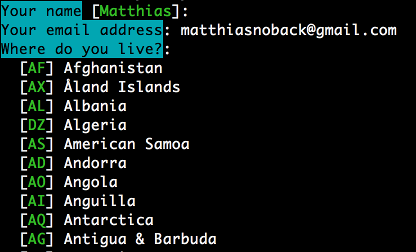

# Symfony Console Form

By Matthias Noback

[](https://travis-ci.org/matthiasnoback/symfony-console-form)

This package contains a Symfony bundle and some tools which enable you to use Symfony Form types to define and
interactively process user input from the CLI.

# Installation

    composer require matthiasnoback/symfony-console-form

Enable `Matthias\SymfonyConsoleForm\Bundle\SymfonyConsoleFormBundle` in the kernel of your Symfony application.
```php
    <?php
    // app/AppKernel.php

    public function registerBundles()
    {
        $bundles = array(
            // ...
            new Matthias\SymfonyConsoleForm\Bundle\SymfonyConsoleFormBundle(),
        );
    }
```

# Usage

Follow the steps below or just clone this project, then run:

    php test/console.php form:demo

## Set up the form

```php
<?php

use Symfony\Component\Form\AbstractType;
use Symfony\Component\Form\FormBuilderInterface;
use Symfony\Component\OptionsResolver\OptionsResolverInterface;
use Symfony\Component\Validator\Constraints\Country;
use Symfony\Component\Validator\Constraints\Email;

class DemoType extends AbstractType
{
    public function buildForm(FormBuilderInterface $builder, array $options)
    {
        $builder
            ->add(
                'name',
                'text',
                [
                    'label' => 'Your name',
                    'required' => true,
                    'data' => 'Matthias'
                ]
            )
            ...
        ;
    }

    public function setDefaultOptions(OptionsResolverInterface $resolver)
    {
        $resolver->setDefaults(['data_class' => 'Matthias\SymfonyConsoleForm\Tests\Data\Demo']);
    }

    public function getName()
    {
        return 'test';
    }
}
```

The corresponding `Demo` class looks like this:

```php
<?php

class Demo
{
    public $name;
    ...
}
```

## Create the console command; use the `form` helper

```php
<?php

use Symfony\Component\Console\Command\Command;
use Symfony\Component\Console\Input\InputInterface;
use Symfony\Component\Console\Output\OutputInterface;
use Matthias\SymfonyConsoleForm\Console\Helper\FormHelper;

class TestCommand extends Command
{
    protected function configure()
    {
        $this->setName('form:demo');
    }

    protected function execute(InputInterface $input, OutputInterface $output)
    {
        $formHelper = $this->getHelper('form');
        /** @var FormHelper $formHelper */

        $formData = $formHelper->interactUsingForm(new DemoType(), $input, $output);

        // $formData is the valid and populated form data object/array
        ...
    }
}
```



When you provide command-line options with the names of the form fields, those values will be used as default values.

If you add the `--no-interaction` option when running the command, it will submit the form using the input options you provided.

If the submitted data is invalid the command will fail.

# TODO

- Provide example of stand-alone usage (no need to extend the command)
- Maybe: provide a way to submit a form at once, possibly using a JSON-encoded array
- Add more functional tests
- Show form label of root form
- Show nesting in form hierarchy using breadcrumbs
- When these things have been provided, release this as a package (or multiple packages for stand-alone use)
